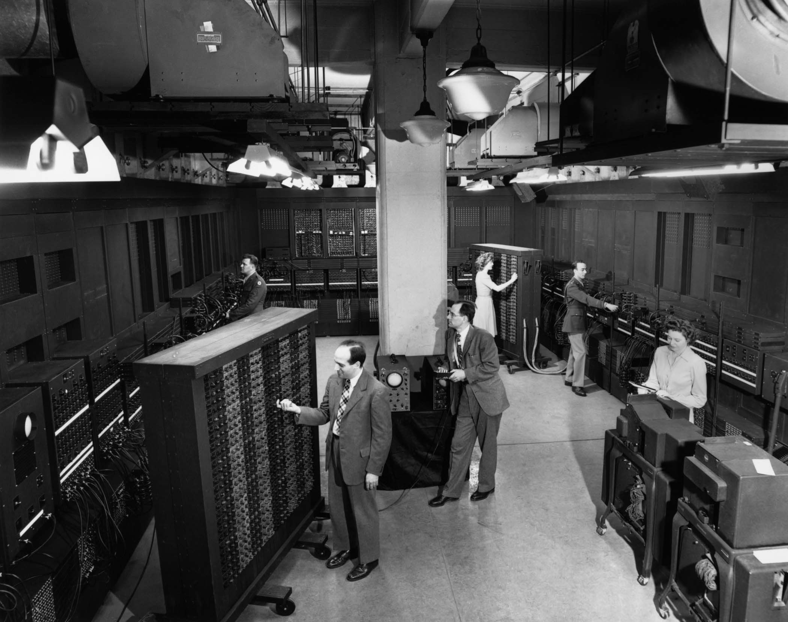
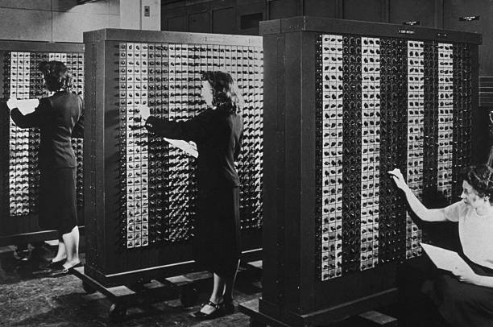
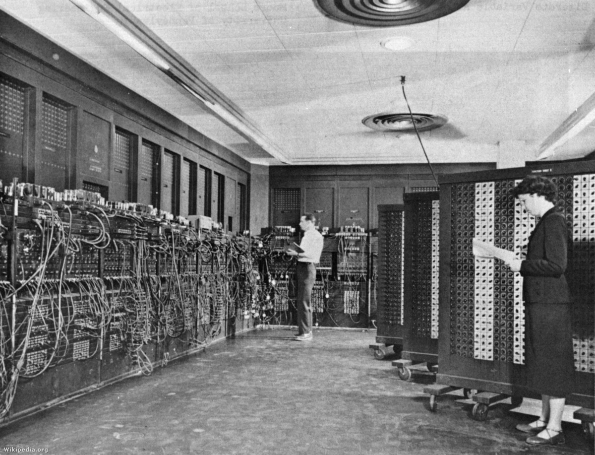
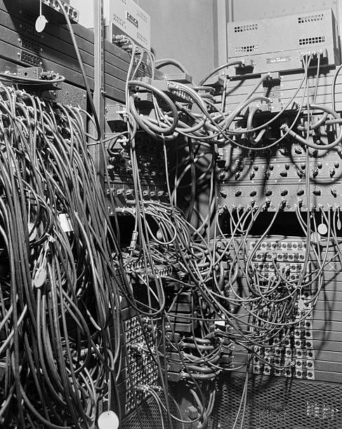
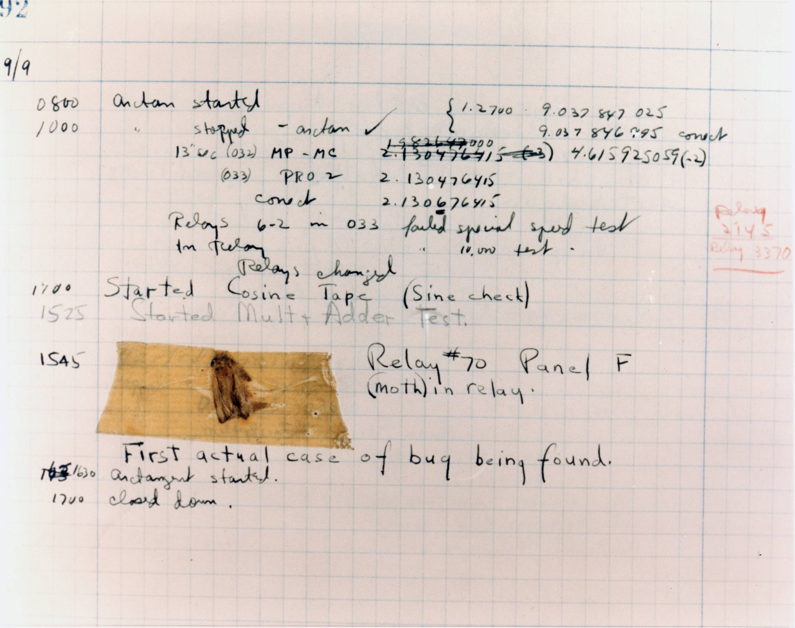
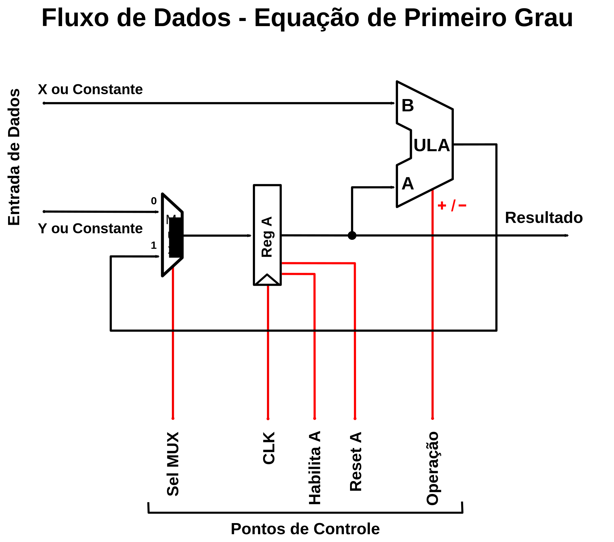
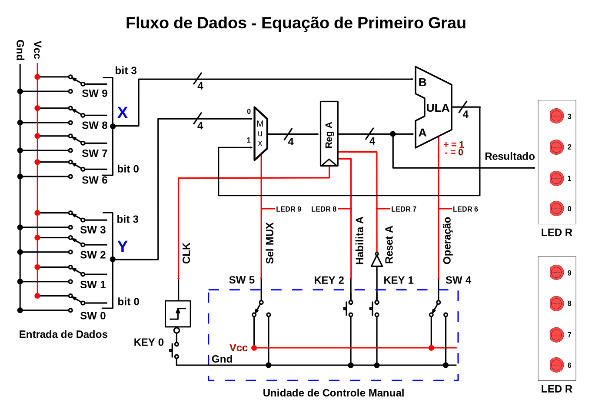
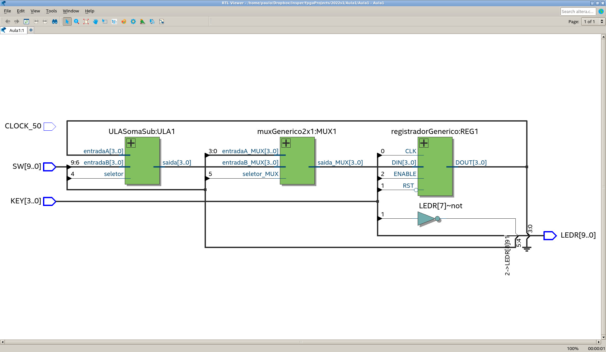

# Aula 1: O Fluxo de Dados

**Questão:** Como era a programação na Era do ENIAC?

## Objetivos

1.  Introduzir o conceito de Fluxo de Dados (FD).

## Pré-requisitos

Ter o Quartus Prime Lite 20.1 instalado e funcional. Ele está disponível no site da Intel:

[Download Center for FPGAs](http://fpgasoftware.intel.com/?edition=lite   "Baixar Quartus Lite"){target="_blank"}

<!--
<br><div class="quiz" style="width:600px;"><div class="row"><div class="column" style="width:60px;">
{style="width:40px;"}
</div><div class="column"  style="width:500px;">
<p>Fazer a avaliação de início de curso (não vale nota), no blackboard em:</p>
<p>Conteúdos > Participação > Pré Requisito de Conhecimentos</p></div></div></div><br>
-->

Ter feito o _Tutorial para início das Aulas: Uso do Quartus e VHDL_, que está no blackboard em:

- Conteúdos > Atividades > Tutoriais > Quartus > Tutorial para início das Aulas: Uso do Quartus e VHDL.

***

## Contextualização 1

<button class="accordion">Funcionamento do ENIAC</button>
<div class="panel">

O ENIAC, criado por John Presper Eckert e John Mauchly entre 1943 e 1945 na Universidade da Pensilvania, foi considerado por muito tempo o primeiro computador de uso geral já construído. Porém, ele não possuía uma caracteristica muito importante, a capacidade de armazenar o programa sendo executado para uso posterior. O conceito de programa armazenado, foi implementado no sucessor do ENIAC, o EDVAC.

Características do ENIAC:

-   Principal finalidade: cálculos balísticos;

-   Consumia 150 kW de potência;

-   Tinha 18.000 válvulas;

-   Pesava aproximadamente 30 toneladas;

-   Ocupava 170 metros quadrados;

-   Processava, por segundo, 5.000 adições ou 357 multiplicações ou 38 divisões;

-   Entrada de dados através de cartões perfurados;

-   A saída de dados era dada por uma sequência de lâmpadas e um perfurador de cartões;

-   Não foi utilizado durante a segunda guerra mas participou nos cálculos da bomba de hidrogênio.


<div class="row">
  <div class="column">

{style="width:400px;height:auto;"}

  </div> <!-- Coluna -->
  <div class="column">

{style="width:400px;height:auto;"}

  </div> <!-- Coluna -->
</div> <!-- Linha -->

Na verdade, o ENIAC era uma coleção de unidades funcionais que eram interconectadas e configuradas para resolver um determinado problema matemático. Ou seja, a programação do ENIAC era feita através da conexão de cabos e configuração de chaves nos painéis dessas unidades funcionais.

<div class="row">
  <div class="column">

{style="width:400px;max-width:100%;height:auto;"}

  </div>
  <div class="column">

{style="width:400px;max-width:100%;height:auto;"}

  </div>
</div>

<div class="row">
  <div class="column">

{style="width:400px;max-width:100%;height:auto;"}

  </div>
  <div class="column">

{style="width:400px;max-width:100%;height:auto;"}
  </div>
</div>

Com o objetivo do programa definido, era feita a sua programação através de esquemas de conexão.

{style="width:800px;max-width:100%;height:auto;"}

A programação do ENIAC era a criação de um caminho para os dados, ou fluxo de dados, que resolvesse o problema em questão. Uma atividade similar ainda é utilizada na criação de projetos digitais, mais especificamente, no projeto de processadores.

**Curiosidade**

O primeiro _bug_ verdadeiro foi encontrado, em 09 de setembro de 1947, no computador Mark II, em Harvard. Fazia parte da equipe a criadora do primeiro compilador: Grace Murray Hopper.

{style="width:800px;max-width:100%;"}

</div>
</div><!--- class_panel --->

<button class="accordion">Fluxo de Dados ou Caminho de Dados</button>
<div class="panel">

Por exemplo, para criar, de forma semelhante ao que era feito no ENIAC, um caminho de dados que resolva a seguinte equação:

**S = 2x - 3y + 7**

Utilizaríamos unidades funcionais para executar as somas e outra para executar a subtração.

<p><font style="color:red;font-weight:bold;">As unidades funcionais utilizam os operandos, indicados pelas letras A e B, da seguinte forma: A operação B.<br>Ou seja, no caso de se usar um subtrator, a saída dele será dada por: A - B.</font></p>
<br>

{style="width:600px;max-width:100%;height:auto;"}

Um grande inconveniente, similar ao que ocorria com o ENIAC, é a necessidade de reconectar (reprogramar) as unidades funcionais para resolver outra equação diferente.

Por exemplo, para a equação **S = 3x + 3y - 5**, teríamos o FD mostrado abaixo.

{style="width:600px;max-width:100%;height:auto;"}

Além disso, para cada operação temos que usar uma unidade funcional nova, não há como reutilizar a mesma unidade várias vezes.

<br><div class="quiz"><div class="row">
<div class="column" style="width:60px;">
{style="width:30px;"}
</div>
<div class="column"  style="width:500px;">
<p>Responder o quiz de participação, no blackboard, em:</p>
<p>Conteúdos > Participação > Aula_1_Quiz-P1</p>
</div></div></div><br>

</div><!--- class_panel --->

<button class="accordion">Fluxo de Dados Configurável</button>
<div class="panel">

Para otimizar a utilização dos componentes do fluxo de dados, podemos fazer com que ele seja configurável dinamicamente.
Uma forma de fazer isso é utilizando elementos que memorizem os resultados intermediários e adicionar circuitos multiplex para reconfigurar o caminho de dados.

{style="width:600px;max-width:100%;"}

A configuração do FD é feita pela alteração dos sinais de controle de acordo com o cálculo que desejamos fazer. Por exemplo, para calcular o valor de _3x - 4_, podemos utilizar a seguinte sequência passos de ativação dos pontos de controle.

### Primeiro Passo para a Equação _3x - 4_

- Iniciamos fazendo o RESET (pulso no ponto de controle _Reset A_, permanecendo em 0 após o pulso) do registrador A. Isso fará com que esse registrador, também chamado de ACUMULADOR, tenha o valor 0.

- Colocamos o valor de "x" na entrada B da ULA.

- Selecionamos a soma como a operação da ULA a ser executada (ponto de controle _Operação_ = 1).

- Selecionamos a entrada 1 do MUX, para que o resultado da operação seja armazenado no Acumulador (ponto de controle _Sel MUX_ = 1).

- Ativamos o Acumulador (ponto de controle _Habilita A_ = 1), para que o resultado da soma seja escrito no Acumulador no momento da subida do próximo _clock_.


{style="width:600px;max-width:100%;"}

Como o _clock_ ainda não ocorreu, após o tempo de propagação dos sinais pelo FD, teremos a entrada do Acumulador com o valor de "x" e a sua saída com o valor anterior (após o reset) 0.

No momento do pulso de _clock_, a saída do Acumulador é atualizada para o valor "x".

- Enviamos o pulso de _clock_.

De agora em diante, a cada pulso de _clock_ adicionaremos "x" ao Acumulador. Ou seja, teremos o resultado acumulado das somas.

{style="width:600px;max-width:100%;"}

### Segundo Passo para a Equação _3x - 4_

Este passo, como visto anteriormente, é o envio de um pulso de _clock_.

Após esse _clock_ teremos o valor de "x+x+x" na entrada do Acumulador, como pode ser visto abaixo.

{style="width:600px;max-width:100%;"}


### Terceiro Passo para a Equação _3x - 4_

Este passo é o envio de um pulso de _clock_, para obter o resultado final das somas com "x" no Acumulador.

{style="width:600px;max-width:100%;"}

### Quarto Passo para a Equação _3x - 4_

Neste passo, precisamos:

- Mudar a entrada de dados para o valor 4 (entrada B da ULA).

- Mudar a operação para realizar a subtração (ponto de controle _Operação_ = 0).


{style="width:600px;max-width:100%;"}


Ao enviar o último pulso de _clock_, armazenamos no acumulador o valor 3X-4.

{style="width:600px;max-width:100%;"}

<br>
<div class="quiz">
<div class="row">
<div class="column" style="width:60px;">
{style="width:30px;"}
</div>
<div class="column"  style="width:500px;">
<p>Responder o quiz de participação, no blackboard, em:</p>
<p>Conteúdos > Participação > Aula_1_Quiz-P2</p>
</div>
</div>
</div><br>

</div><!--- class_panel --->

***


## Atividade 1

<button class="accordion">Implementar o Fluxo de Dados Configurável e Executar a Equação _3x - 4_</button>
<div class="panel">

Para tanto, utilizaremos uma ULA que possui somente a soma e a subtração, que está na ABA _Modelos VHDL_.

Os outros componentes utilizados também estão na ABA _Modelos VHDL_.

As características do circuito estão listadas abaixo:

-   Dados com largura de 4 bits;

-   As entradas _x_ e _y_ devem ser conectadas às chaves de entrada da placa DE0-CV:

    - As chaves SW3 até SW0 serão a variável _y_;

    - As chaves SW9 até SW6 serão a variável _x_;

-   A saída _S_ (Resultado) deve ser conectada aos LEDs vermelhos.

- É obrigatório a utilização de um detector de borda, também chamado de discriminador de borda, na entrada do botão de _clock_.

  - Note que o _clock_ da placa, que é chamado de _CLOCK_50_, deve ser conectado ao detector de borda.

Para cada projeto, deve existir a definição da funcionalidade dos pinos da FPGA em um arquivo do tipo _.qsf_.

Durante a criação do projeto, o _Quartus_ cria, na pasta principal do seu projeto, um arquivo chamado _Nome_do_Projeto.qsf_.

Ele contém as definições básicas do projeto e deve ser acrescentada a definição dos pinos. Essa definição está na ABA: _Modelos VHDL > Kit DE0-CV > Arquivo de Configuração dos Pinos (.qsf) do Kit FPGA DE0CV para o Quartus_.

Para confirmar o funcionamento do seu projeto, veja o circuito RTL resultante e faça a simulação.

Após o circuito funcionar adequadamente, grave-o na FPGA e faça alguns testes para confirmar o seu funcionamento.

Verifique o funcionamento do sinal _Habilita A_.  O que ocorre se o sinal _Habilita A_ estiver em nível 0 e ocorrer um pulso de _clock_?

> **Devido ao uso de 4 bits, é necessário restringir os números utilizados para evitar ultrapassar o limite representável pelos 4 bits (valor decimal = 15).**


**Esquema Completo (com entradas e saídas).**

As conexões dos I/Os da placa DE0-CV são mostrado abaixo:

{style="width:800px;max-width:100%;"}


### Procedimento

O seu projeto será formado por cinco arquivos, todos eles baseados na estrura do esqueleto (disponível na ABA _Modelos VHDL_), que são:

- O _top level_, que é o arquivo principal (similar ao _main_ da linguagem C), que conterá:

  - Todas as instâncias dos componentes a serem usados (cada modelo VHDL dos componentes possui um exemplo da sua instanciação);

  - A interligação entre esses componentes, também conhecido como _port map_ de cada instância de componente;

  - A declaração e interligação dos recursos externos à FPGA com o circuitos que usam esses componentes. Isso é feito através do _port_ da declaração da _entity_ e do arquivo _.qsf_ (disponível na ABA _Referências_).

- Um arquivo para o MUX, chamado muxGenerico2x1.vhd, que será preenchido com o modelo VHDL de "MUX Genérico" (disponível na ABA _Modelos VHDL_);

- Um arquivo para o Registrador, chamado registradorGenerico.vhd, que será preenchido com o modelo VHDL de "Registrador Genérico" (disponível na ABA _Modelos VHDL_);

- Um arquivo para a ULA, chamado ULASomaSub.vhd, que será preenchido com o modelo VHDL de "ULA: Soma e Subtração" (disponível na ABA _Modelos VHDL_).

- Um arquivo para o Detector de Borda, chamado edgeDetector.vhd, que será preenchido com o modelo VHDL de "Detector de Borda" (disponível na ABA _Modelos VHDL_).

> **O estado em repouso do Botão é o nível ALTO, portanto, para o RESET devemos usar not KEY(1).**

Abaixo, temos um exemplo do _top_level_ desta atividade, completo e funcional.

Note que, para interligar os compontentes, utilizamos a declaração _signal_, como mostrado no exemplo abaixo.

```vhdl

library ieee;
use ieee.std_logic_1164.all;

entity Aula1 is
  -- Total de bits das entradas e saidas
  generic ( larguraDados : natural := 4;
              simulacao : boolean := TRUE -- para gravar na placa, altere de TRUE para FALSE
  );
  port   (
    CLOCK_50 : in std_logic;
    KEY: in std_logic_vector(3 downto 0);
    SW: in std_logic_vector(9 downto 0);
    LEDR  : out std_logic_vector(9 downto 0)
  );
end entity;

architecture arquitetura of Aula1 is
-- Obs.:
-- SW(9 downto 6) : entrada da variavel X.
-- SW(3 downto 0) : entrada da variavel Y.
-- SW(4) : o ponto de controle da Operacao da ULA.
-- SW(5) : o ponto de controle de SelMUX.
-- KEY(0) : o botão do clock.
-- KEY(1) : o ponto de controle para Reset A (o Botao em repouso fica no nível alto, portanto, devemos usar not KEY(1) no Reset).
-- KEY(2) : o ponto de controle de Habilita A.
-- KEY(3) : sem uso.

  signal chavesX_ULA_B : std_logic_vector (larguraDados-1 downto 0);
  signal chavesY_MUX_A : std_logic_vector (larguraDados-1 downto 0);
  signal REG1_ULA_A : std_logic_vector (larguraDados-1 downto 0);
  signal Saida_ULA : std_logic_vector (larguraDados-1 downto 0);
  signal MUX_REG_A : std_logic_vector (larguraDados-1 downto 0);
  signal Chave_Operacao_ULA : std_logic;
  signal CLK : std_logic;
  signal SelMUX : std_logic;
  signal Habilita_A : std_logic;
  signal Reset_A : std_logic;
  signal Operacao_ULA : std_logic;
begin

-- Instanciando os componentes:

-- Para simular, fica mais simples tirar o edgeDetector
gravar:  if simulacao generate
CLK <= KEY(0);
else generate
detectorSub0: work.edgeDetector(bordaSubida)
        port map (clk => CLOCK_50, entrada => (not KEY(0)), saida => CLK);
end generate;

-- Instancia do MUX.
MUX1 :  entity work.muxGenerico2x1  generic map (larguraDados => larguraDados)
        port map( entradaA_MUX => chavesY_MUX_A,
                 entradaB_MUX =>  Saida_ULA,
                 seletor_MUX => SelMUX,
                 saida_MUX => MUX_REG_A);

-- Instancia do Acumulador.
REG1 : entity work.registradorGenerico   generic map (larguraDados => larguraDados)
          port map (DIN => MUX_REG_A, DOUT => REG1_ULA_A, ENABLE => Habilita_A, CLK => CLK, RST => Reset_A);

-- Instancia da ULA:
ULA1 : entity work.ULASomaSub  generic map(larguraDados => larguraDados)
          port map (entradaA => REG1_ULA_A, entradaB =>  chavesX_ULA_B, saida => Saida_ULA, seletor => SW(4));

-- Chaves e Botoes.
chavesX_ULA_B <= SW(9 downto 6);
chavesY_MUX_A <= SW(3 downto 0);
SelMUX <= SW(5);
Operacao_ULA <= SW(4);
Reset_A <= not KEY(1);
Habilita_A <= KEY(2);


-- A ligacao dos LEDs:
LEDR (9) <= SelMUX;
LEDR (8) <= Habilita_A;
LEDR (7) <= Reset_A;
LEDR (6) <= Operacao_ULA;
LEDR (5) <= '0';    -- Apagado.
LEDR (4) <= '0';    -- Apagado.
LEDR (3 downto 0) <= REG1_ULA_A;

end architecture;

```

### Verificação através do RTL

Para verificar se o projeto está conforme o desejado, podemos utilizar o visualizador RTL. No Quartus, ele está em:

- Tools > Netlist Viewers > RTL Viewer.

O diagrama obtido deverá ser similar ao abaixo.

{style="width:800px;"}

### Teste com a Equação _3x - 4_

Com o circuito pronto, faça o teste utilizando a equação _3x - 4_. A sequência dos pontos de controle são as mesmas mostradas no exemplo anterior.

Para facilitar, faça uma tabela com essa sequência, que reutilizaremos na próxima aula.

</div><!--- class_panel --->

<br><div class="quiz" style="width:600px;"><div class="row"><div class="column" style="width:60px;">
{style="width:30px;"}
</div><div class="column"  style="width:500px;">
<p>Esta Atividade deverá ser entregue através do Blackboard!</p>
</div></div></div><br>

***

## Relatório de Fim de Atividade

O relatório de fim de atividade possui algumas questões sobre o desenvolvimento dela e uma pesquisa sobre as dificuldades encontradas.

Nesta aula, este relatório não tem o preenchimento obrigatório, servindo somente como primeiro contato.

<button class="accordion">Preencher e Enviar o Relatório (abaixo) Após a Conclusão da Atividade</button>
<div class="panel">

<iframe src="https://docs.google.com/forms/d/e/1FAIpQLScBH8L_4guuggtYmliMj-blL1FdGbK4gCYHyZN2zQp7pgiX2A/viewform?embedded=true" width="640" height="400" frameborder="0" marginheight="0" marginwidth="0">Carregando…</iframe>

</div><!--- class_panel --->

***

## Ferramenta Auxiliar: Conversor Binário para Decimal (com ou sem sinal)

<div style="width:600px;margin:10px auto;font-family:Courier New,Courier,monospace;">
<form>
<div style="width:50%;float:left;display:inline-block;">
<label for="entrada">Valor em Binário:</label>
<textarea id="entrada" cols="32" rows="1" title="Valor em binário a ser convertido" onkeyup="validaBinario(id)" style="resize:none;"></textarea>
</div>
<div style="width:50%;float:left;display:inline-block;">
<label for="saida">Resultado da Conversão:</label>
<textarea id="saida" cols="32"  rows="1" title="Valor convertido" style="resize:none;"></textarea>
</div>
<input type="button" value="Converter" onclick="converteBinario(entrada);"/>&nbsp;&nbsp;&nbsp;
<input type="checkbox" id="tiposigned" style="vertical-align:middle;">Binário com Sinal</input>
</form>
</div>
<script type="text/javascript">
function converteBinario(nome) {
tipo = document.getElementById("tiposigned").checked;
binStr = nome.value;
if (binStr === "") {
document.getElementById("saida").value = "Faltou o valor de entrada.";
}else{
if (tipo){
document.getElementById("saida").value = converteSignedDecimal(binStr);
}else{
document.getElementById("saida").value = converteUnsignedDecimal(binStr);
}
}
}
</script>

<br>
[Outras Ferramentas][Ferramentas]
<br>

***

<br>

***

***

<script type="text/javascript" src="./js/acordeon.js"></script>
<script src="./js/binario.js"></script>
<!-- FIM -->

<!---
######### (inicio dos links) ##########
--->

[compilacao]: ./quartus/_referenciaQuartus.html {target="_blank"}

[simulacaoVWF]: ./quartus/_referenciaQuartus.html {target="_blank"}

[bibliotecaTemplates]: ./quartus/_referenciaQuartus.html {target="_blank"}

[visualizacaoRTL]: ./quartus/_referenciaQuartus.html {target="_blank"}

[vhdlBasico]:  ./vhdl/_vhdlBasico.html {target="_blank"}

[componentesVHDL]: ./vhdl/_componentesVHDL.html {target="_blank"}

[novoProjeto]: ./quartus/_referenciaQuartus.html {target="_blank"}

[recursosQuartus]: ./quartus/_referenciaQuartus.html {target="_blank"}

[adicionarArqProjeto]: ./quartus/_referenciaQuartus.html {target="_blank"}

[clausulaBiblioteca]: ./quartus/_referenciaQuartus.html {target="_blank"}

[clausulaUse]: ./quartus/_referenciaQuartus.html {target="_blank"}

[entidade]: ./quartus/_referenciaQuartus.html {target="_blank"}

[arquitetura]: ./quartus/_referenciaQuartus.html {target="_blank"}

[topLevelEntity]: ./quartus/_referenciaQuartus.html {target="_blank"}

[portMap]:  ./vhdl/_vhdlBasico.html#instancia%C3%A7%C3%A3o-de-componentes {target="_blank"}

[QSF]:  ./Referencias.html {target="_blank"}

[Ferramentas]: ./Ferramentas.html   {target="_blank"}
