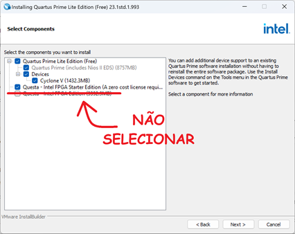
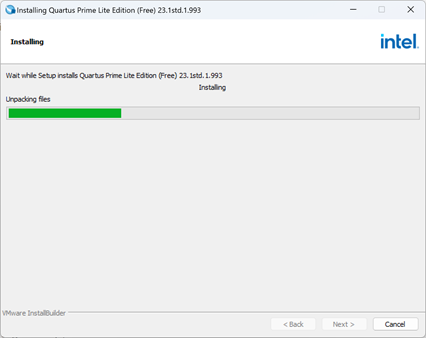
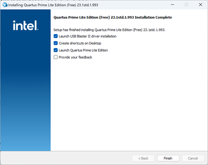
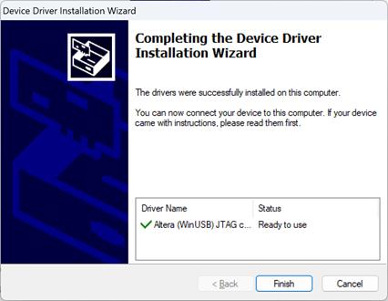

Windows 11
==========

Por: Marco Antonio Soares de Mello Alves (Laboratório de Arquitetura de Computadores)

Dúvidas:

> **Email: marcoasma@insper.edu.br**

Quartus 23.1 e Questa 23.1
============================

Instalando
----------
 

1.  Faça o download dos arquivos a seguir (salve na mesma pasta, todos os arquivos):
 
 
**IMPORTANTE!!!**: Faça o download dos 3 arquivos, todos em uma única pasta antes de instalar. 

-   Quartus Lite 23.1.1:
    https://downloads.intel.com/akdlm/software/acdsinst/23.1std.1/993/ib_installers/QuartusLiteSetup-23.1std.1.993-windows.exe

-   Questa 23.1.1 (Simulador):
    https://downloads.intel.com/akdlm/software/acdsinst/23.1std.1/993/ib_installers/QuestaSetup-23.1std.1.993-windows.exe

-   Cyclone V (Chip usado no curso) :
    https://downloads.intel.com/akdlm/software/acdsinst/23.1std.1/993/ib_installers/cyclonev-23.1std.1.993.qdz
     
     
     
2.  Execute o arquivo **QuartusLiteSetup-23.1std.1.993-windows.exe** e clique **Next** até a janela da imagem abaixo:

$${\color{red}ATENÇÃO!!!}$$: **Não** selecionar a última opção (**Questa - Intel FPGA Edition**), conforme a imagem abaixo:

  

 
 
 
3. Após isso a inicialização deverá iniciar, conforme imagem abaixo:

  

 
 
 

4.  Após a instalação, finalize-a com as seguintes opções:

  

 
 
 
5.  O instalador irá instalar o **USB Blaster** automaticamente:

  

> [!WARNING]
>
> 
Validando
=========

1.  Execute o Quartus (**Quartus (Quartus Prime 23.1) Lite Edition**), esse ícone deverá estar na sua área de trabalho:

  

2. Por fim, o programa deverá abrir:

  

