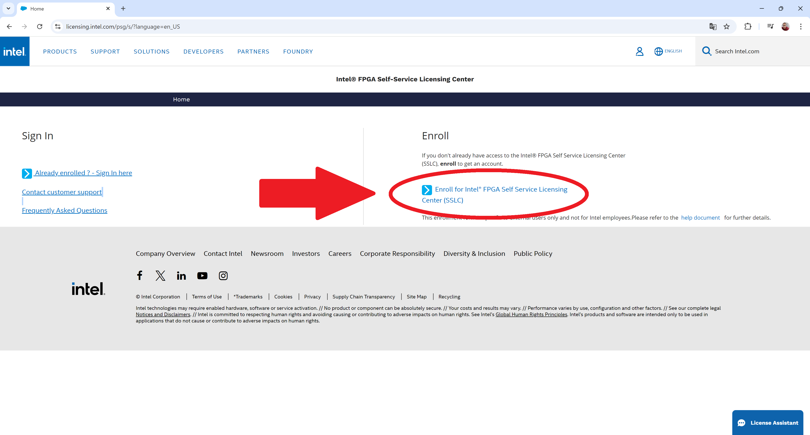

Ativando a Licença para o simulador Questa-Intel® FPGA
----------------------------------------------------------

#### 1. Acesse o Intel® FPGA Self-Service Licensing Center

[httpslicensing.intel.com](httpslicensing.intel.com)

#### 2. Clique em Enroll para criar uma conta



#### 3. Siga os passos para criação de uma conta


#### 4. Após a criação, você poderá solicitar a licença

OBS Pode acontecer que você só consiga fazer o acesso para solicitar a licença após 2 horas.


#### 5. Acesse sua conta

OBS algumas etapas de verificação e autenticação deverão ser solicitadas.


#### 6. Clique em Computers and License Files  Active Computers


#### 7. Clique em New


#### 8. Preencha conforme a imagem abaixo

OBS O campo Primary Computer ID deverá ser preenchido com o MAC Address da placa de rede da sua máquina, sem os caraceteres que os Números e Letrtas (- ou ).


#### 9. Acesse a opção Sign up for Evaluation or No-Cost Licenses


#### 10. Selecione a opção do Questa, conforme a imagem abaixo e clique em next


#### 11. Selecione o ComputadorMAC para o qual a licença será gerada, aceite os termos e clique em Generate


#### 12. Após isso, você receberá uma confirmação de que a licença foi enviada para seu e-mail


#### 13. Faça o download da licença


OBS¹ Renomei o arquivo .dat para license.dat.

#### 14. Crie uma pastadiretório de nome 'license_questa' em

WINDOWS - 'CintelFPGA_lite23.1std'

LINUX - '~intelFPGA_lite23.1std'

mova o arquivo license.dat (o arquivo q foi renomeado) para a pasta criada 'license_questa'.

#### 15 .Variáveis de Ambiente

Após isso, basta fazer com que a licença seja reconhecida pelas variáveis de ambientes do seu sistema operacional (Windows ou Linux)

###### WINDOWS

Abra o Windows PowerShell como administrador e execute o seguinte comando para configurar o LM_LICENSE_FILE nas variáveis de ambiente

```
setx LM_LICENSE_FILE CintelFPGA_litelicense_questalicense.dat;
```

###### LINUX

Execute o comando abaixo no terminal

    export LM_LICENSE_FILE=~intelFPGA_litelicense_questalicense.dat
    

#### Renovação da Licença

A licença do software expira 12 meses após a data da compra. Para renovar um arquivo de licença expirado, revisite o [SSLC](httpsfpgasupport.intel.comLicensinglicenseindex.html) . Você pode renovar uma licença somente para a versão que você comprou.

#### FONTE

[httpswww.intel.comcontentwwwusendocsprogrammable68347224-2and-software-license.html](httpswww.intel.comcontentwwwusendocsprogrammable68347224-2and-software-license.html)
